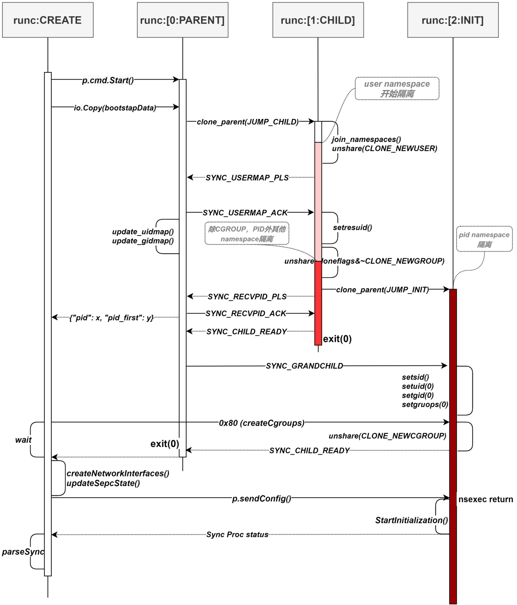

# runc运行容器init阶段
> $ `runc init`是bootstrap阶段启动的一个子进程，用来完成容器的真正隔离运行。这个运行阶段简称runc_init吧，用来和bootstrap区分


### runc init代码的go入口
```diff
import (
	"fmt"
	"os"
	"runtime"
	"strconv"

	"github.com/opencontainers/runc/libcontainer"
	"github.com/opencontainers/runc/libcontainer/logs"
+	_ "github.com/opencontainers/runc/libcontainer/nsenter"
	"github.com/sirupsen/logrus"
)

func init() {
	if len(os.Args) > 1 && os.Args[1] == "init" {
		// This is the golang entry point for runc init, executed
		// before main() but after libcontainer/nsenter's nsexec().
		runtime.GOMAXPROCS(1)
		runtime.LockOSThread()

		level := os.Getenv("_LIBCONTAINER_LOGLEVEL")
		logLevel, err := logrus.ParseLevel(level)
		if err != nil {
			panic(fmt.Sprintf("libcontainer: failed to parse log level: %q: %v", level, err))
		}

		logPipeFdStr := os.Getenv("_LIBCONTAINER_LOGPIPE")
		logPipeFd, err := strconv.Atoi(logPipeFdStr)
		if err != nil {
			panic(fmt.Sprintf("libcontainer: failed to convert environment variable _LIBCONTAINER_LOGPIPE=%s to int: %s", logPipeFdStr, err))
		}
		err = logs.ConfigureLogging(logs.Config{
			LogPipeFd: logPipeFd,
			LogFormat: "json",
			LogLevel:  logLevel,
		})
		if err != nil {
			panic(fmt.Sprintf("libcontainer: failed to configure logging: %v", err))
		}
		logrus.Debug("child process in init()")

		factory, _ := libcontainer.New("")
		if err := factory.StartInitialization(); err != nil {
			// as the error is sent back to the parent there is no need to log
			// or write it to stderr because the parent process will handle this
			os.Exit(1)
		}
		panic("libcontainer: container init failed to exec")
	}
}
```
注意，上面引入了nsenter包。nsensor包里，go语言部分是空的，只有cgo部分。很简单，就init里调用nexec()
```
package nsenter

/*
#cgo CFLAGS: -Wall
extern void nsexec();
void __attribute__((constructor)) init(void) {
	nsexec();
}
*/
import "C"
```
> 什么是 nsenter，nsenter 是 runc 中的一个package，它包含了一个特殊的C语言实现的构造函数（CGO），用来在 Go代码启动之前做一些事情，比如 setns()。<br>
> 在cgo中，如果在 C 的 import 后紧跟注释，则在编译程序包的 C 语言实现部分时，该注释将用作header。
> 因此，每次 import nsenter 时，nsexec()都会调用 C 函数。在 runc 中只有 init.go import了nsenter。
> 容器技术最关键的就是 namespace 和 cgroup，其中 namespace 是通过 setns() 函数来实现的，
> 但是 setns() 有一个问题： A multithreaded process may not change user namespace with setns(). 。
> 而go runtime是多线程的，所以需要在 go runtime 启动前执行setns()设置好 namespace，然后再走 go 相关实现流程。


在实际的 nsenter 实现中，存在3个进程，分别为 parent, child, grandchild。<br>
注意，这个三个进程是兄弟关系，不是父子关系。<br>
在注释中可以看到nsenter实现过程中的考虑：

> parent (init_0)
>> parent 进程通过环境变量 _LIBCONTAINER_INITPIPE 获取相关配置信息，然后 clone 出 child 进程，当 child 进程 ready 之后设置 user map，从 child 进程中接受 grandchild 进程 pid，然后通过管道传递给外层的 runc 进程。parent 进程退出条件为 child 进程和 grandchild 都处于 ready 状态后，parent 进程退出。之所以要 clone child 进程，是因为如果创建了 user namespace，那么 user map 只能由原有的 user namespace 设置，所以需要 clone child 进程，然后在 parent 进程中设置 user map。

> child (init_1)
>> child 进程先执行 setns()，在一些老版本的kernel 中，CLONE_PARENT flag 与 CLONE_NEWPID 有冲突，所以使用 unshare 创建 user namespace， user namespace 需要先于其他 namespace 创建，创建 user namespace 并设置 user map，才有能力创建其他的 namespace。等待 parent 进程设置 user map 后，设置 child 当前进程的 uid 为 root(0) ，使用 unshare 创建其他 namespace，然后 clone grandchild 进程，并将 grandchild 进程 pid 传递给 parent，然后退出。之所以要 clone grandchild 进程，是因为在 child 进程中设置 namespace 并不会在 child 进程中生效，所以需要 clone 出一个新的进程，继承 namespace 配置。

> grandchild（init_2)
>> grandchild 进程就是容器真正的进程，在确保 parent 和 child 进程都处于 ready 之后，设置 uid,gid，从管道中读取相应配置信息，然后 unshare 创建 cgroup namespace，然后将状态发送给 parent 后 返回。grandchild 进程返回后继续执行 go 代码流程。

- init -> nsexec
```diff
void nsexec(void)
{
	int pipenum;
	jmp_buf env;
	int sync_child_pipe[2], sync_grandchild_pipe[2];
	struct nlconfig_t config = { 0 };

	/*
	 * Setup a pipe to send logs to the parent. This should happen
	 * first, because bail will use that pipe.
	 */
	setup_logpipe();

+	// initPipe检查有没有设置环境变量_LIBCONTAINER_INITPIPE，如果没有就直接退出了
	/*
	 * If we don't have an init pipe, just return to the go routine.
	 * We'll only get an init pipe for start or exec.
	 */
+	pipenum = initpipe();
	if (pipenum == -1)
		return;

+	// 通过将runc重新挂载，载入到只读的内存当中，Fix CVE问题
	/*
	 * We need to re-exec if we are not in a cloned binary. This is necessary
	 * to ensure that containers won't be able to access the host binary
	 * through /proc/self/exe. See CVE-2019-5736.
	 */
	if (ensure_cloned_binary() < 0)
		bail("could not ensure we are a cloned binary");

+	// 通知run create端initWaiter，runc init上线，nsenter要开始工作了
	/*
	 * Inform the parent we're past initial setup.
	 * For the other side of this, see initWaiter.
	 */
	if (write(pipenum, "", 1) != 1)
		bail("could not inform the parent we are past initial setup");

	write_log(DEBUG, "=> nsexec container setup");
	
+	//调用nl_parse来获取bootstrap发送的namespace的配置信息。
+	//在initProcess.start中bootstrap通过调用io.Copy(p.parentPipe, p.bootstrapData)往管道里写入了这些信息，
+	//这边借用netlink payload实现(消息编解码格式)来在不同进程之间的传递多种消息。
	/* Parse all of the netlink configuration. */
+	nl_parse(pipenum, &config);

	/* Set oom_score_adj. This has to be done before !dumpable because
	 * /proc/self/oom_score_adj is not writeable unless you're an privileged
	 * user (if !dumpable is set). All children inherit their parent's
	 * oom_score_adj value on fork(2) so this will always be propagated
	 * properly.
	 */
	update_oom_score_adj(config.oom_score_adj, config.oom_score_adj_len);

	/*
	 * Make the process non-dumpable, to avoid various race conditions that
	 * could cause processes in namespaces we're joining to access host
	 * resources (or potentially execute code).
	 *
	 * However, if the number of namespaces we are joining is 0, we are not
	 * going to be switching to a different security context. Thus setting
	 * ourselves to be non-dumpable only breaks things (like rootless
	 * containers), which is the recommendation from the kernel folks.
	 */
	if (config.namespaces) {
		write_log(DEBUG, "set process as non-dumpable");
		if (prctl(PR_SET_DUMPABLE, 0, 0, 0, 0) < 0)
			bail("failed to set process as non-dumpable");
	}

+	// 创建与child，也就是init_1通信的sockpair 
	/* Pipe so we can tell the child when we've finished setting up. */
	if (socketpair(AF_LOCAL, SOCK_STREAM, 0, sync_child_pipe) < 0)
		bail("failed to setup sync pipe between parent and child");

+	// 创建与grandchild，也就是init_2通信的sockpair 
	/*
	 * We need a new socketpair to sync with grandchild so we don't have
	 * race condition with child.
	 */
	if (socketpair(AF_LOCAL, SOCK_STREAM, 0, sync_grandchild_pipe) < 0)
		bail("failed to setup sync pipe between parent and grandchild");

	/* TODO: Currently we aren't dealing with child deaths properly. */

	/*
	 * Okay, so this is quite annoying.
	 *
	 * In order for this unsharing code to be more extensible we need to split
	 * up unshare(CLONE_NEWUSER) and clone() in various ways. The ideal case
	 * would be if we did clone(CLONE_NEWUSER) and the other namespaces
	 * separately, but because of SELinux issues we cannot really do that. But
	 * we cannot just dump the namespace flags into clone(...) because several
	 * usecases (such as rootless containers) require more granularity around
	 * the namespace setup. In addition, some older kernels had issues where
	 * CLONE_NEWUSER wasn't handled before other namespaces (but we cannot
	 * handle this while also dealing with SELinux so we choose SELinux support
	 * over broken kernel support).
	 *
	 * However, if we unshare(2) the user namespace *before* we clone(2), then
	 * all hell breaks loose.
	 *
	 * The parent no longer has permissions to do many things (unshare(2) drops
	 * all capabilities in your old namespace), and the container cannot be set
	 * up to have more than one {uid,gid} mapping. This is obviously less than
	 * ideal. In order to fix this, we have to first clone(2) and then unshare.
	 *
	 * Unfortunately, it's not as simple as that. We have to fork to enter the
	 * PID namespace (the PID namespace only applies to children). Since we'll
	 * have to double-fork, this clone_parent() call won't be able to get the
	 * PID of the _actual_ init process (without doing more synchronisation than
	 * I can deal with at the moment). So we'll just get the parent to send it
	 * for us, the only job of this process is to update
	 * /proc/pid/{setgroups,uid_map,gid_map}.
	 *
	 * And as a result of the above, we also need to setns(2) in the first child
	 * because if we join a PID namespace in the topmost parent then our child
	 * will be in that namespace (and it will not be able to give us a PID value
	 * that makes sense without resorting to sending things with cmsg).
	 *
	 * This also deals with an older issue caused by dumping cloneflags into
	 * clone(2): On old kernels, CLONE_PARENT didn't work with CLONE_NEWPID, so
	 * we have to unshare(2) before clone(2) in order to do this. This was fixed
	 * in upstream commit 1f7f4dde5c945f41a7abc2285be43d918029ecc5, and was
	 * introduced by 40a0d32d1eaffe6aac7324ca92604b6b3977eb0e. As far as we're
	 * aware, the last mainline kernel which had this bug was Linux 3.12.
	 * However, we cannot comment on which kernels the broken patch was
	 * backported to.
	 *
	 * -- Aleksa "what has my life come to?" Sarai
	 */

	current_stage = setjmp(env);
	switch (current_stage) {
		/*
		 * Stage 0: We're in the parent. Our job is just to create a new child
		 *          (stage 1: STAGE_CHILD) process and write its uid_map and
		 *          gid_map. That process will go on to create a new process, then
		 *          it will send us its PID which we will send to the bootstrap
		 *          process.
		 */
+	case STAGE_PARENT:{
			int len;
			pid_t stage1_pid = -1, stage2_pid = -1;
			bool stage1_complete, stage2_complete;

			/* For debugging. */
			prctl(PR_SET_NAME, (unsigned long)"runc:[0:PARENT]", 0, 0, 0);
			write_log(DEBUG, "~> nsexec stage-0");

			/* Start the process of getting a container. */
			write_log(DEBUG, "spawn stage-1");
+			// clone如果设置了CLONE_PARENT，子进程的父进程(使用getppid(2)获取)和调用进程的父进程相同。
+			stage1_pid = clone_parent(&env, STAGE_CHILD);
			if (stage1_pid < 0)
				bail("unable to spawn stage-1");

			syncfd = sync_child_pipe[1];
			if (close(sync_child_pipe[0]) < 0)
				bail("failed to close sync_child_pipe[0] fd");

			/*
			 * State machine for synchronisation with the children. We only
			 * return once both the child and grandchild are ready.
			 */
			write_log(DEBUG, "-> stage-1 synchronisation loop");
			stage1_complete = false;
			while (!stage1_complete) {
				enum sync_t s;

+				// 监听child的通道，处理相应的请求，如SYNC_USERMAP_PLS，SYNC_RECVPID_PLS等
				if (read(syncfd, &s, sizeof(s)) != sizeof(s))
					bail("failed to sync with stage-1: next state");

				switch (s) {
				case SYNC_USERMAP_PLS:
					write_log(DEBUG, "stage-1 requested userns mappings");

					/*
					 * Enable setgroups(2) if we've been asked to. But we also
					 * have to explicitly disable setgroups(2) if we're
					 * creating a rootless container for single-entry mapping.
					 * i.e. config.is_setgroup == false.
					 * (this is required since Linux 3.19).
					 *
					 * For rootless multi-entry mapping, config.is_setgroup shall be true and
					 * newuidmap/newgidmap shall be used.
					 */
					if (config.is_rootless_euid && !config.is_setgroup)
						update_setgroups(stage1_pid, SETGROUPS_DENY);

					/* Set up mappings. */
					update_uidmap(config.uidmappath, stage1_pid, config.uidmap, config.uidmap_len);
					update_gidmap(config.gidmappath, stage1_pid, config.gidmap, config.gidmap_len);

					s = SYNC_USERMAP_ACK;
					if (write(syncfd, &s, sizeof(s)) != sizeof(s)) {
						sane_kill(stage1_pid, SIGKILL);
						sane_kill(stage2_pid, SIGKILL);
						bail("failed to sync with stage-1: write(SYNC_USERMAP_ACK)");
					}
					break;
				case SYNC_RECVPID_PLS:
					write_log(DEBUG, "stage-1 requested pid to be forwarded");

+					// 得到init_2的pid，也就是grand child
					/* Get the stage-2 pid. */
					if (read(syncfd, &stage2_pid, sizeof(stage2_pid)) != sizeof(stage2_pid)) {
						sane_kill(stage1_pid, SIGKILL);
						sane_kill(stage2_pid, SIGKILL);
						bail("failed to sync with stage-1: read(stage2_pid)");
					}

					/* Send ACK. */
					s = SYNC_RECVPID_ACK;
					if (write(syncfd, &s, sizeof(s)) != sizeof(s)) {
						sane_kill(stage1_pid, SIGKILL);
						sane_kill(stage2_pid, SIGKILL);
						bail("failed to sync with stage-1: write(SYNC_RECVPID_ACK)");
					}

+					// 把init_1和init_2的PID都发给runc_create
					/*
					 * Send both the stage-1 and stage-2 pids back to runc.
					 * runc needs the stage-2 to continue process management,
					 * but because stage-1 was spawned with CLONE_PARENT we
					 * cannot reap it within stage-0 and thus we need to ask
					 * runc to reap the zombie for us.
					 */
					write_log(DEBUG, "forward stage-1 (%d) and stage-2 (%d) pids to runc",
						  stage1_pid, stage2_pid);
					len =
					    dprintf(pipenum, "{\"stage1_pid\":%d,\"stage2_pid\":%d}\n", stage1_pid,
						    stage2_pid);
					if (len < 0) {
						sane_kill(stage1_pid, SIGKILL);
						sane_kill(stage2_pid, SIGKILL);
						bail("failed to sync with runc: write(pid-JSON)");
					}
					break;
				case SYNC_CHILD_FINISH:
					write_log(DEBUG, "stage-1 complete");
					stage1_complete = true;
					break;
				default:
					bail("unexpected sync value: %u", s);
				}
			}
			write_log(DEBUG, "<- stage-1 synchronisation loop");

			/* Now sync with grandchild. */
			syncfd = sync_grandchild_pipe[1];
			if (close(sync_grandchild_pipe[0]) < 0)
				bail("failed to close sync_grandchild_pipe[0] fd");

+			// 和init_2保持sync，直到init_2完成所有任务
			write_log(DEBUG, "-> stage-2 synchronisation loop");
			stage2_complete = false;
			while (!stage2_complete) {
				enum sync_t s;

				write_log(DEBUG, "signalling stage-2 to run");
				s = SYNC_GRANDCHILD;
				if (write(syncfd, &s, sizeof(s)) != sizeof(s)) {
					sane_kill(stage2_pid, SIGKILL);
					bail("failed to sync with child: write(SYNC_GRANDCHILD)");
				}

				if (read(syncfd, &s, sizeof(s)) != sizeof(s))
					bail("failed to sync with child: next state");

				switch (s) {
				case SYNC_CHILD_FINISH:
					write_log(DEBUG, "stage-2 complete");
					stage2_complete = true;
					break;
				default:
					bail("unexpected sync value: %u", s);
				}
			}
			write_log(DEBUG, "<- stage-2 synchronisation loop");
			write_log(DEBUG, "<~ nsexec stage-0");
+			// init的3进程中第2个领盒饭的。			
+			exit(0);
		}
		break;

		/*
		 * Stage 1: We're in the first child process. Our job is to join any
		 *          provided namespaces in the netlink payload and unshare all of
		 *          the requested namespaces. If we've been asked to CLONE_NEWUSER,
		 *          we will ask our parent (stage 0) to set up our user mappings
		 *          for us. Then, we create a new child (stage 2: STAGE_INIT) for
		 *          PID namespace. We then send the child's PID to our parent
		 *          (stage 0).
		 */
+	case STAGE_CHILD:{
			pid_t stage2_pid = -1;
			enum sync_t s;

			/* We're in a child and thus need to tell the parent if we die. */
			syncfd = sync_child_pipe[0];
			if (close(sync_child_pipe[1]) < 0)
				bail("failed to close sync_child_pipe[1] fd");

			/* For debugging. */
			prctl(PR_SET_NAME, (unsigned long)"runc:[1:CHILD]", 0, 0, 0);
			write_log(DEBUG, "~> nsexec stage-1");

+			// 如果config.json中namespace配置了path，则这里需要将其加入到path指定的namesapce中。k8s的多容器的pod会调用到此处
			/*
			 * We need to setns first. We cannot do this earlier (in stage 0)
			 * because of the fact that we forked to get here (the PID of
			 * [stage 2: STAGE_INIT]) would be meaningless). We could send it
			 * using cmsg(3) but that's just annoying.
			 */
			if (config.namespaces)
+				join_namespaces(config.namespaces);

+			// 如果config.json中设置了user，则创建user namespace
			/*
			 * Deal with user namespaces first. They are quite special, as they
			 * affect our ability to unshare other namespaces and are used as
			 * context for privilege checks.
			 *
			 * We don't unshare all namespaces in one go. The reason for this
			 * is that, while the kernel documentation may claim otherwise,
			 * there are certain cases where unsharing all namespaces at once
			 * will result in namespace objects being owned incorrectly.
			 * Ideally we should just fix these kernel bugs, but it's better to
			 * be safe than sorry, and fix them separately.
			 *
			 * A specific case of this is that the SELinux label of the
			 * internal kern-mount that mqueue uses will be incorrect if the
			 * UTS namespace is cloned before the USER namespace is mapped.
			 * I've also heard of similar problems with the network namespace
			 * in some scenarios. This also mirrors how LXC deals with this
			 * problem.
			 */
			if (config.cloneflags & CLONE_NEWUSER) {
				write_log(DEBUG, "unshare user namespace");
				if (unshare(CLONE_NEWUSER) < 0)
					bail("failed to unshare user namespace");
				config.cloneflags &= ~CLONE_NEWUSER;

				/*
				 * We need to set ourselves as dumpable temporarily so that the
				 * parent process can write to our procfs files.
				 */
				if (config.namespaces) {
					write_log(DEBUG, "temporarily set process as dumpable");
					if (prctl(PR_SET_DUMPABLE, 1, 0, 0, 0) < 0)
						bail("failed to temporarily set process as dumpable");
				}

				/*
				 * We don't have the privileges to do any mapping here (see the
				 * clone_parent rant). So signal stage-0 to do the mapping for
				 * us.
				 */
				write_log(DEBUG, "request stage-0 to map user namespace");
				s = SYNC_USERMAP_PLS;
				if (write(syncfd, &s, sizeof(s)) != sizeof(s))
					bail("failed to sync with parent: write(SYNC_USERMAP_PLS)");

				/* ... wait for mapping ... */
				write_log(DEBUG, "request stage-0 to map user namespace");
				if (read(syncfd, &s, sizeof(s)) != sizeof(s))
					bail("failed to sync with parent: read(SYNC_USERMAP_ACK)");
				if (s != SYNC_USERMAP_ACK)
					bail("failed to sync with parent: SYNC_USERMAP_ACK: got %u", s);

				/* Revert temporary re-dumpable setting. */
				if (config.namespaces) {
					write_log(DEBUG, "re-set process as non-dumpable");
					if (prctl(PR_SET_DUMPABLE, 0, 0, 0, 0) < 0)
						bail("failed to re-set process as non-dumpable");
				}

				/* Become root in the namespace proper. */
				if (setresuid(0, 0, 0) < 0)
					bail("failed to become root in user namespace");
			}

			/*
			 * Unshare all of the namespaces. Now, it should be noted that this
			 * ordering might break in the future (especially with rootless
			 * containers). But for now, it's not possible to split this into
			 * CLONE_NEWUSER + [the rest] because of some RHEL SELinux issues.
			 *
			 * Note that we don't merge this with clone() because there were
			 * some old kernel versions where clone(CLONE_PARENT | CLONE_NEWPID)
			 * was broken, so we'll just do it the long way anyway.
			 */
			write_log(DEBUG, "unshare remaining namespace (except cgroupns)");
			if (unshare(config.cloneflags & ~CLONE_NEWCGROUP) < 0)
				bail("failed to unshare remaining namespaces (except cgroupns)");

			/*
			 * TODO: What about non-namespace clone flags that we're dropping here?
			 *
			 * We fork again because of PID namespace, setns(2) or unshare(2) don't
			 * change the PID namespace of the calling process, because doing so
			 * would change the caller's idea of its own PID (as reported by getpid()),
			 * which would break many applications and libraries, so we must fork
			 * to actually enter the new PID namespace.
			 */
+			// 创建grand child，也就是init_2
			write_log(DEBUG, "spawn stage-2");
+			stage2_pid = clone_parent(&env, STAGE_INIT);
			if (stage2_pid < 0)
				bail("unable to spawn stage-2");

			/* Send the child to our parent, which knows what it's doing. */
			write_log(DEBUG, "request stage-0 to forward stage-2 pid (%d)", stage2_pid);
			s = SYNC_RECVPID_PLS;
			if (write(syncfd, &s, sizeof(s)) != sizeof(s)) {
				sane_kill(stage2_pid, SIGKILL);
				bail("failed to sync with parent: write(SYNC_RECVPID_PLS)");
			}
			if (write(syncfd, &stage2_pid, sizeof(stage2_pid)) != sizeof(stage2_pid)) {
				sane_kill(stage2_pid, SIGKILL);
				bail("failed to sync with parent: write(stage2_pid)");
			}

			/* ... wait for parent to get the pid ... */
			if (read(syncfd, &s, sizeof(s)) != sizeof(s)) {
				sane_kill(stage2_pid, SIGKILL);
				bail("failed to sync with parent: read(SYNC_RECVPID_ACK)");
			}
			if (s != SYNC_RECVPID_ACK) {
				sane_kill(stage2_pid, SIGKILL);
				bail("failed to sync with parent: SYNC_RECVPID_ACK: got %u", s);
			}

			write_log(DEBUG, "signal completion to stage-0");
			s = SYNC_CHILD_FINISH;
			if (write(syncfd, &s, sizeof(s)) != sizeof(s)) {
				sane_kill(stage2_pid, SIGKILL);
				bail("failed to sync with parent: write(SYNC_CHILD_FINISH)");
			}

			/* Our work is done. [Stage 2: STAGE_INIT] is doing the rest of the work. */
			write_log(DEBUG, "<~ nsexec stage-1");
+			// init_1是nsenter的3个进程中第1个领盒饭的
+			exit(0);
		}
		break;

		/*
		 * Stage 2: We're the final child process, and the only process that will
		 *          actually return to the Go runtime. Our job is to just do the
		 *          final cleanup steps and then return to the Go runtime to allow
		 *          init_linux.go to run.
		 */
+	case STAGE_INIT:{
			/*
			 * We're inside the child now, having jumped from the
			 * start_child() code after forking in the parent.
			 */
			enum sync_t s;

			/* We're in a child and thus need to tell the parent if we die. */
			syncfd = sync_grandchild_pipe[0];
			if (close(sync_grandchild_pipe[1]) < 0)
				bail("failed to close sync_grandchild_pipe[1] fd");

			if (close(sync_child_pipe[0]) < 0)
				bail("failed to close sync_child_pipe[0] fd");

			/* For debugging. */
			prctl(PR_SET_NAME, (unsigned long)"runc:[2:INIT]", 0, 0, 0);
			write_log(DEBUG, "~> nsexec stage-2");

			if (read(syncfd, &s, sizeof(s)) != sizeof(s))
				bail("failed to sync with parent: read(SYNC_GRANDCHILD)");
			if (s != SYNC_GRANDCHILD)
				bail("failed to sync with parent: SYNC_GRANDCHILD: got %u", s);

			if (setsid() < 0)
				bail("setsid failed");

			if (setuid(0) < 0)
				bail("setuid failed");

			if (setgid(0) < 0)
				bail("setgid failed");

			if (!config.is_rootless_euid && config.is_setgroup) {
				if (setgroups(0, NULL) < 0)
					bail("setgroups failed");
			}
+			// 设置CGroup namespace，从pipe中读取一个字节值为0x80
			if (config.cloneflags & CLONE_NEWCGROUP) {
				if (unshare(CLONE_NEWCGROUP) < 0)
					bail("failed to unshare cgroup namespace");
			}

			write_log(DEBUG, "signal completion to stage-0");
			s = SYNC_CHILD_FINISH;
			if (write(syncfd, &s, sizeof(s)) != sizeof(s))
				bail("failed to sync with patent: write(SYNC_CHILD_FINISH)");

			/* Close sync pipes. */
			if (close(sync_grandchild_pipe[0]) < 0)
				bail("failed to close sync_grandchild_pipe[0] fd");

			/* Free netlink data. */
			nl_free(&config);
+			// 接下来又重新被go的部分接管
			/* Finish executing, let the Go runtime take over. */
			write_log(DEBUG, "<= nsexec container setup");
			write_log(DEBUG, "booting up go runtime ...");
			return;
		}
		break;
	default:
		bail("unknown stage '%d' for jump value", current_stage);
	}

	/* Should never be reached. */
	bail("should never be reached");
}
```

### 讲解几个重要函数
- clone_parent函数。利用setjmp和longjmp实现跨函数Goto
```
/* A dummy function that just jumps to the given jumpval. */
static int child_func(void *arg) __attribute__((noinline));
static int child_func(void *arg)
{
	struct clone_t *ca = (struct clone_t *)arg;
	longjmp(*ca->env, ca->jmpval);
}

static int clone_parent(jmp_buf *env, int jmpval) __attribute__((noinline));
static int clone_parent(jmp_buf *env, int jmpval)
{
	struct clone_t ca = {
		.env = env,
		.jmpval = jmpval,
	};

	return clone(child_func, ca.stack_ptr, CLONE_PARENT | SIGCHLD, &ca);
}
```

- join_namespaces
```
void join_namespaces(char *nslist)
{
	int num = 0, i;
	char *saveptr = NULL;
	char *namespace = strtok_r(nslist, ",", &saveptr);
	struct namespace_t {
		int fd;
		char type[PATH_MAX];
		char path[PATH_MAX];
	} *namespaces = NULL;

	if (!namespace || !strlen(namespace) || !strlen(nslist))
		bail("ns paths are empty");

	/*
	 * We have to open the file descriptors first, since after
	 * we join the mnt namespace we might no longer be able to
	 * access the paths.
	 */
	do {
		int fd;
		char *path;
		struct namespace_t *ns;

		/* Resize the namespace array. */
		namespaces = realloc(namespaces, ++num * sizeof(struct namespace_t));
		if (!namespaces)
			bail("failed to reallocate namespace array");
		ns = &namespaces[num - 1];

		/* Split 'ns:path'. */
		path = strstr(namespace, ":");
		if (!path)
			bail("failed to parse %s", namespace);
		*path++ = '\0';

		fd = open(path, O_RDONLY);
		if (fd < 0)
			bail("failed to open %s", path);

		ns->fd = fd;
		strncpy(ns->type, namespace, PATH_MAX - 1);
		strncpy(ns->path, path, PATH_MAX - 1);
		ns->path[PATH_MAX - 1] = '\0';
	} while ((namespace = strtok_r(NULL, ",", &saveptr)) != NULL);

	/*
	 * The ordering in which we join namespaces is important. We should
	 * always join the user namespace *first*. This is all guaranteed
	 * from the container_linux.go side of this, so we're just going to
	 * follow the order given to us.
	 */

	for (i = 0; i < num; i++) {
		struct namespace_t *ns = &namespaces[i];
		int flag = nsflag(ns->type);

		write_log(DEBUG, "setns(%#x) into %s namespace (with path %s)", flag, ns->type, ns->path);
		if (setns(ns->fd, flag) < 0)
			bail("failed to setns into %s namespace", ns->type);

		close(ns->fd);
	}

	free(namespaces);
}
```
### 回到init阶段的go代码部分
- init -> libcontainer.New
```
func init() {
	if len(os.Args) > 1 && os.Args[1] == "init" {
		// This is the golang entry point for runc init, executed
		// before main() but after libcontainer/nsenter's nsexec().
		runtime.GOMAXPROCS(1)
		runtime.LockOSThread()

		level := os.Getenv("_LIBCONTAINER_LOGLEVEL")
		logLevel, err := logrus.ParseLevel(level)
		if err != nil {
			panic(fmt.Sprintf("libcontainer: failed to parse log level: %q: %v", level, err))
		}

		logPipeFdStr := os.Getenv("_LIBCONTAINER_LOGPIPE")
		logPipeFd, err := strconv.Atoi(logPipeFdStr)
		if err != nil {
			panic(fmt.Sprintf("libcontainer: failed to convert environment variable _LIBCONTAINER_LOGPIPE=%s to int: %s", logPipeFdStr, err))
		}
		err = logs.ConfigureLogging(logs.Config{
			LogPipeFd: logPipeFd,
			LogFormat: "json",
			LogLevel:  logLevel,
		})
		if err != nil {
			panic(fmt.Sprintf("libcontainer: failed to configure logging: %v", err))
		}
		logrus.Debug("child process in init()")

		factory, _ := libcontainer.New("")
		if err := factory.StartInitialization(); err != nil {
			// as the error is sent back to the parent there is no need to log
			// or write it to stderr because the parent process will handle this
			os.Exit(1)
		}
		panic("libcontainer: container init failed to exec")
	}
}
```

- init -> factory.StartInitialization
```diff
func (l *LinuxFactory) StartInitialization() (err error) {
+	// 获取init的管道，用来和bootstrap那边通话	
	// Get the INITPIPE.
	envInitPipe := os.Getenv("_LIBCONTAINER_INITPIPE")
	pipefd, err := strconv.Atoi(envInitPipe)
	if err != nil {
		return fmt.Errorf("unable to convert _LIBCONTAINER_INITPIPE: %w", err)
	}
	pipe := os.NewFile(uintptr(pipefd), "pipe")
	defer pipe.Close()

	// Only init processes have FIFOFD.
	fifofd := -1
	envInitType := os.Getenv("_LIBCONTAINER_INITTYPE")
	it := initType(envInitType)
	if it == initStandard {
		envFifoFd := os.Getenv("_LIBCONTAINER_FIFOFD")
		if fifofd, err = strconv.Atoi(envFifoFd); err != nil {
			return fmt.Errorf("unable to convert _LIBCONTAINER_FIFOFD: %w", err)
		}
	}

	var consoleSocket *os.File
	if envConsole := os.Getenv("_LIBCONTAINER_CONSOLE"); envConsole != "" {
		console, err := strconv.Atoi(envConsole)
		if err != nil {
			return fmt.Errorf("unable to convert _LIBCONTAINER_CONSOLE: %w", err)
		}
		consoleSocket = os.NewFile(uintptr(console), "console-socket")
		defer consoleSocket.Close()
	}

	logPipeFdStr := os.Getenv("_LIBCONTAINER_LOGPIPE")
	logPipeFd, err := strconv.Atoi(logPipeFdStr)
	if err != nil {
		return fmt.Errorf("unable to convert _LIBCONTAINER_LOGPIPE: %w", err)
	}

	// clear the current process's environment to clean any libcontainer
	// specific env vars.
	os.Clearenv()

	defer func() {
		// We have an error during the initialization of the container's init,
		// send it back to the parent process in the form of an initError.
		if werr := utils.WriteJSON(pipe, syncT{procError}); werr != nil {
			fmt.Fprintln(os.Stderr, err)
			return
		}
		if werr := utils.WriteJSON(pipe, &initError{Message: err.Error()}); werr != nil {
			fmt.Fprintln(os.Stderr, err)
			return
		}
	}()
	defer func() {
		if e := recover(); e != nil {
			err = fmt.Errorf("panic from initialization: %w, %v", e, string(debug.Stack()))
		}
	}()

+	i, err := newContainerInit(it, pipe, consoleSocket, fifofd, logPipeFd)
	if err != nil {
		return err
	}

	// If Init succeeds, syscall.Exec will not return, hence none of the defers will be called.
+	return i.Init()
}
```

- init -> factory.StartInitialization -> newContainerInit
> 这里面又两个分支，如果runc run，走initStandard；如果runc exec，
```
func newContainerInit(t initType, pipe *os.File, consoleSocket *os.File, fifoFd, logFd int) (initer, error) {
	var config *initConfig
	if err := json.NewDecoder(pipe).Decode(&config); err != nil {
		return nil, err
	}
	if err := populateProcessEnvironment(config.Env); err != nil {
		return nil, err
	}
	switch t {
	case initSetns:
		return &linuxSetnsInit{
			pipe:          pipe,
			consoleSocket: consoleSocket,
			config:        config,
			logFd:         logFd,
		}, nil
	case initStandard:
		return &linuxStandardInit{
			pipe:          pipe,
			consoleSocket: consoleSocket,
			parentPid:     unix.Getppid(),
			config:        config,
			fifoFd:        fifoFd,
			logFd:         logFd,
		}, nil
	}
	return nil, fmt.Errorf("unknown init type %q", t)
}
```

- init -> factory.StartInitialization -> newContainerInit -> linuxStandardInit
```
type linuxStandardInit struct {
	pipe          *os.File
	consoleSocket *os.File
	parentPid     int
	fifoFd        int
	logFd         int
	config        *initConfig
}
```

- init -> factory.StartInitialization ->  i.Init
> i.Init() 实际上就是linuxStandardInit.Init
```diff
func (l *linuxStandardInit) Init() error {
	runtime.LockOSThread()
	defer runtime.UnlockOSThread()
	if !l.config.Config.NoNewKeyring {
		if err := selinux.SetKeyLabel(l.config.ProcessLabel); err != nil {
			return err
		}
		defer selinux.SetKeyLabel("") //nolint: errcheck
		ringname, keepperms, newperms := l.getSessionRingParams()

		// Do not inherit the parent's session keyring.
		if sessKeyId, err := keys.JoinSessionKeyring(ringname); err != nil {
			// If keyrings aren't supported then it is likely we are on an
			// older kernel (or inside an LXC container). While we could bail,
			// the security feature we are using here is best-effort (it only
			// really provides marginal protection since VFS credentials are
			// the only significant protection of keyrings).
			//
			// TODO(cyphar): Log this so people know what's going on, once we
			//               have proper logging in 'runc init'.
			if !errors.Is(err, unix.ENOSYS) {
				return fmt.Errorf("unable to join session keyring: %w", err)
			}
		} else {
			// Make session keyring searchable. If we've gotten this far we
			// bail on any error -- we don't want to have a keyring with bad
			// permissions.
			if err := keys.ModKeyringPerm(sessKeyId, keepperms, newperms); err != nil {
				return fmt.Errorf("unable to mod keyring permissions: %w", err)
			}
		}
	}

+	// setup网络，调用第三方 netlink.LinkSetup
+	if err := setupNetwork(l.config); err != nil {
		return err
	}
+	// setup静态路由，调用第三方 netlink.RouteAdd
+	if err := setupRoute(l.config.Config); err != nil {
		return err
	}

	// initialises the labeling system
	selinux.GetEnabled()
	if err := prepareRootfs(l.pipe, l.config); err != nil {
		return err
	}
	// Set up the console. This has to be done *before* we finalize the rootfs,
	// but *after* we've given the user the chance to set up all of the mounts
	// they wanted.
	if l.config.CreateConsole {
		if err := setupConsole(l.consoleSocket, l.config, true); err != nil {
			return err
		}
		if err := system.Setctty(); err != nil {
			return &os.SyscallError{Syscall: "ioctl(setctty)", Err: err}
		}
	}

+	// rootfs设置
	// Finish the rootfs setup.
	if l.config.Config.Namespaces.Contains(configs.NEWNS) {
		if err := finalizeRootfs(l.config.Config); err != nil {
			return err
		}
	}

	if hostname := l.config.Config.Hostname; hostname != "" {
		if err := unix.Sethostname([]byte(hostname)); err != nil {
			return &os.SyscallError{Syscall: "sethostname", Err: err}
		}
	}
	if err := apparmor.ApplyProfile(l.config.AppArmorProfile); err != nil {
		return fmt.Errorf("unable to apply apparmor profile: %w", err)
	}

	for key, value := range l.config.Config.Sysctl {
		if err := writeSystemProperty(key, value); err != nil {
			return err
		}
	}
	for _, path := range l.config.Config.ReadonlyPaths {
		if err := readonlyPath(path); err != nil {
			return fmt.Errorf("can't make %q read-only: %w", path, err)
		}
	}
	for _, path := range l.config.Config.MaskPaths {
		if err := maskPath(path, l.config.Config.MountLabel); err != nil {
			return fmt.Errorf("can't mask path %s: %w", path, err)
		}
	}
	pdeath, err := system.GetParentDeathSignal()
	if err != nil {
		return fmt.Errorf("can't get pdeath signal: %w", err)
	}
	if l.config.NoNewPrivileges {
		if err := unix.Prctl(unix.PR_SET_NO_NEW_PRIVS, 1, 0, 0, 0); err != nil {
			return &os.SyscallError{Syscall: "prctl(SET_NO_NEW_PRIVS)", Err: err}
		}
	}
+	// 容器创建以及完毕，通知Parent准备执行命令
	// Tell our parent that we're ready to Execv. This must be done before the
	// Seccomp rules have been applied, because we need to be able to read and
	// write to a socket.
+	if err := syncParentReady(l.pipe); err != nil {
		return fmt.Errorf("sync ready: %w", err)
	}
	if err := selinux.SetExecLabel(l.config.ProcessLabel); err != nil {
		return fmt.Errorf("can't set process label: %w", err)
	}
	defer selinux.SetExecLabel("") //nolint: errcheck
	// Without NoNewPrivileges seccomp is a privileged operation, so we need to
	// do this before dropping capabilities; otherwise do it as late as possible
	// just before execve so as few syscalls take place after it as possible.
	if l.config.Config.Seccomp != nil && !l.config.NoNewPrivileges {
		if err := seccomp.InitSeccomp(l.config.Config.Seccomp); err != nil {
			return err
		}
	}
+	// 根据config配置将需要的特权capabilities加入白名单，设置user namespace，关闭不需要的文件描述符。	
	if err := finalizeNamespace(l.config); err != nil {
		return err
	}
	// finalizeNamespace can change user/group which clears the parent death
	// signal, so we restore it here.
	if err := pdeath.Restore(); err != nil {
		return fmt.Errorf("can't restore pdeath signal: %w", err)
	}
	// Compare the parent from the initial start of the init process and make
	// sure that it did not change.  if the parent changes that means it died
	// and we were reparented to something else so we should just kill ourself
	// and not cause problems for someone else.
	if unix.Getppid() != l.parentPid {
		return unix.Kill(unix.Getpid(), unix.SIGKILL)
	}
	// Check for the arg before waiting to make sure it exists and it is
	// returned as a create time error.
	name, err := exec.LookPath(l.config.Args[0])
	if err != nil {
		return err
	}
	// Close the pipe to signal that we have completed our init.
	logrus.Debugf("init: closing the pipe to signal completion")
	_ = l.pipe.Close()

	// Close the log pipe fd so the parent's ForwardLogs can exit.
	if err := unix.Close(l.logFd); err != nil {
		return &os.PathError{Op: "close log pipe", Path: "fd " + strconv.Itoa(l.logFd), Err: err}
	}

+	// 只写方式打开fifo管道并写入0，会一直保持阻塞，直到管道的另一端以读方式打开，并读取内容，如runc start
	// Wait for the FIFO to be opened on the other side before exec-ing the
	// user process. We open it through /proc/self/fd/$fd, because the fd that
	// was given to us was an O_PATH fd to the fifo itself. Linux allows us to
	// re-open an O_PATH fd through /proc.
	fifoPath := "/proc/self/fd/" + strconv.Itoa(l.fifoFd)
	fd, err := unix.Open(fifoPath, unix.O_WRONLY|unix.O_CLOEXEC, 0)
	if err != nil {
		return &os.PathError{Op: "open exec fifo", Path: fifoPath, Err: err}
	}
+	if _, err := unix.Write(fd, []byte("0")); err != nil {
		return &os.PathError{Op: "write exec fifo", Path: fifoPath, Err: err}
	}
	// Close the O_PATH fifofd fd before exec because the kernel resets
	// dumpable in the wrong order. This has been fixed in newer kernels, but
	// we keep this to ensure CVE-2016-9962 doesn't re-emerge on older kernels.
	// N.B. the core issue itself (passing dirfds to the host filesystem) has
	// since been resolved.
	// https://github.com/torvalds/linux/blob/v4.9/fs/exec.c#L1290-L1318
	_ = unix.Close(l.fifoFd)
	// Set seccomp as close to execve as possible, so as few syscalls take
	// place afterward (reducing the amount of syscalls that users need to
	// enable in their seccomp profiles).
	if l.config.Config.Seccomp != nil && l.config.NoNewPrivileges {
		if err := seccomp.InitSeccomp(l.config.Config.Seccomp); err != nil {
			return fmt.Errorf("unable to init seccomp: %w", err)
		}
	}

	s := l.config.SpecState
	s.Pid = unix.Getpid()
	s.Status = specs.StateCreated
	if err := l.config.Config.Hooks[configs.StartContainer].RunHooks(s); err != nil {
		return err
	}
+	// 执行用户所指定的在容器中运行的程序
	if err := system.Exec(name, l.config.Args[0:], os.Environ()); err != nil {
		return fmt.Errorf("can't exec user process: %w", err)
	}
	return nil
}
```
